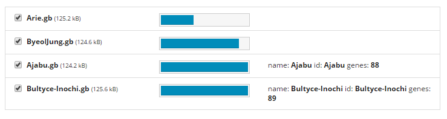
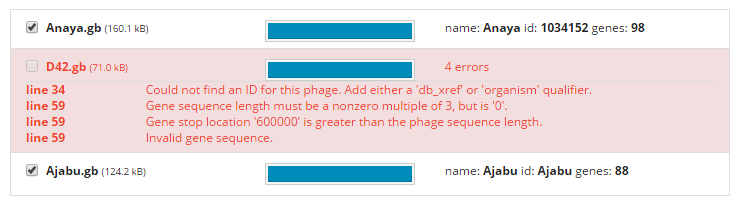
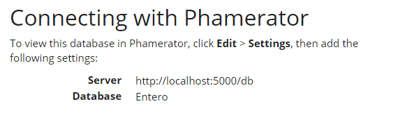

# PhamDB
A web application for creating and modifying [Phamerator](http://phagesdb.org/Phamerator/faq/) databases.

## [Get started](https://github.com/jglamine/phamdb/wiki)
For installation instructions, see [the wiki](https://github.com/jglamine/phamdb/wiki).

## [Help and documentation](https://github.com/jglamine/phamdb/wiki)
Help and documentation are available on [the wiki](https://github.com/jglamine/phamdb/wiki).

### Support
PhamDB was created by James Lamine as his computer science senior project. His advisors for this project were Serita Nelesen and Randal DeJong. For support questions, please contact Serita Nelesen - snelesen (at) calvin (dot) edu

## Features
  
  * Create and manage multiple Phamerator databases
  * Upload genbank files to create a database
  * Add and remove phages from existing databases
  * Analyze your databases in Phamerator
  * See live status of running jobs
  * Queue multiple jobs
  * Search NCBI's conserved domain database

## Screenshots

#### Upload genbank files

#### See detailed error messages of invalid phages

#### Analyze your database in Phamerator

## Minimum system requirements

##### Linux
  
  * Docker
  * 2GB of RAM (4GB recommended)
  * 6GB of hard drive space

##### Windows and Mac OSX
  
  * Docker toolbox
  * 4GB of ram
  * 6GB of hard drive space

##### Recommended

  * Dual core processor

## For developers

PhamDB is a Python Flask application. It uses Python 2.7, MySQL and RabbitMQ, and calls several Linux command line programs to process gene data.

The easiest way to see how the application is set up is to read the `Dockerfile` (`docker/Dockerfile`). It contains information on the various dependencies required. Note that `nginx` and `uwsgi` are only needed for production, not development.

### Setup

Read the `Dockerfile` (`docker/Dockerfile`) to see the basics of how the application is set up.

Among other things, be sure to clone the repository, install the required linux packages, create a python virtual environment, install python packages from `requirements.txt`, add the project to the virtual environment's `PYTHONPATH`, run the database creation script, download the conserved domain database using the included makefile (`pham/data/conserved-domain-database/Makefile`), and verify that all of the tests pass.

### Running PhamDB locally

Once you have installed the dependencies and required python packages, you will have to run two commands:

Run the application server with:

    python webphamerator/run.py

Run the Celery background job processor with:

    celery -A webphamerator.app.celery worker

### Testing

From the project's root directory, run the tests with:

    nosetests

## License

PhamDB is licensed under the GNU GPL, version 3. See `license.txt` for the full license.
